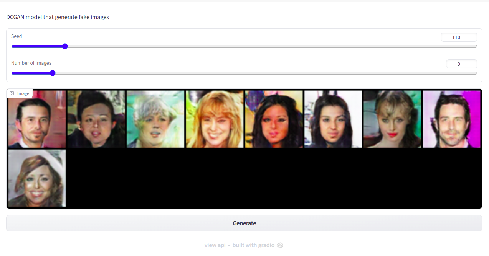

# DCGAN

In this project I have implemented the DCGAN (DEEP CONVOLUTIONAL GENERATIVE ADVERSARIAL NETWORKS) from [this paper](https://arxiv.org/pdf/1511.06434.pdf) using PyTorch. The file in ```./notebook``` contains the source code (written with python notebook) of the built model which located in ```./model```. I have also used ```gradio``` to build a web application.

## Execution

```python3 app.py```

## Results



## Deployment

I have deployed this app using **huggingFace space**, check the app [App](https://huggingface.co/spaces/AyoubMDL/DCGAN).
